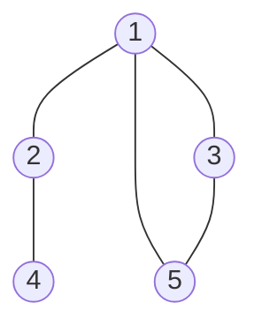
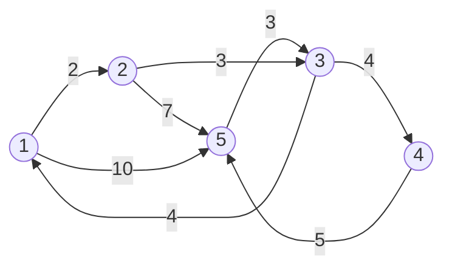
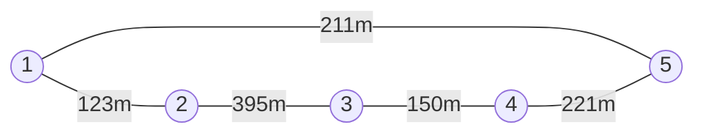
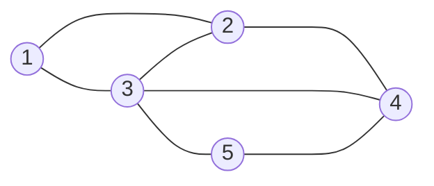

# 排序
## 桶排序(简化版)
- step1:判断排序数的最大范围
- step2:确定桶的数量为'max+1'
- step3:如果有和桶序号j相等的数arr[i]就让桶内的数+1也就是'trr[j]++'
- 最后输出桶的序号即可
- 核心思想：利用桶下标自带的顺序
```C
//size为桶大小,arr为需要排序的数组
#define NUM  10
void bucket_sort(int *arr,int size)
{
    int i,j;
    int trr[size];

    i = 0;
    j = 0;

    //initial bucket
    for (i = 0; i < size; i++)
        trr[i] = 0;
    //input arr[] to bucket
    for (i = 0; i < NUM; i++)
        trr[arr[i]]++;
    // min to max
    for (i = 0;i < size; i++)
        for (j = 1; j <= trr[i]; j++)
            printf("%d ",i);
    
    // //max to min
    // for (i = size - 1;i >= 0; i--)
    //     for(j = 1; j < trr[i]; j++)
    //         printf("%d ",i);
    
}
```
## 冒泡排序
- 一个一个泡泡冒出来一样，也就是从最底下比较两个数大小，小的和大的交换位置，那么一直比较相邻两个数，最后会形成小的泡泡越往上，大的泡泡越往下
```C
#define NUM  10
void bubble_sort(int *arr)
{
    int i,j,temp;
    i = 0;
    j = 0;
    for (i = 0; i < NUM;  i++)
    {
        for (j = 0; j < NUM - i - 1; j++)//此处-i-1非常重要
        {
            if (arr[j] > arr[j+1])
            {
                temp = arr[j];
                arr[j] = arr[j+1];
                arr[j+1] = temp;
            }
        }
    }
    for(i = 0; i < NUM; i++)
        printf("%d ",arr[i]);
}
```
## 快速排序
- step1:选择一个基准数(通常为第一个数)pivot
- step2:让小于pivot的数排在左边，让大于pivot的数排在右边
- 左 pivot 右
- step3:利用递归思想继续分别对pivot左边和右边做同样的操作
- 最后得到的就是所有pivot的正确位置即所有数从小到大
```C
void quick_sort(int *arr, int arr_size) {
    // 递归终止条件
    if (arr_size <= 1) {
        return;
    }

    int pivot = arr[0];  // 基准数（可优化为随机选择）
    int left = 0;
    int right = arr_size - 1;
    int temp;

    // 分区操作
    while (left < right) {
        // 从右向左找第一个小于 pivot 的元素
        while (left < right && arr[right] >= pivot) {
            right--;
        }

        arr[left] = arr[right];  // 将小的放到左边

        // 从左向右找第一个大于 pivot 的元素
        while (left < right && arr[left] <= pivot) {
            left++;
        }
        arr[right] = arr[left];// 将大的放到右边
        // temp = arr[left];
        // arr[left] = arr[right];
        // arr[right] = temp;
    }
    arr[left] = pivot;  // 放置基准值

    // 递归排序子数组
    quick_sort(arr, left);                // 左半部分
    quick_sort(arr + left + 1, arr_size - left - 1);  // 右半部分
}
```
## 队列
- 先进先出，像排队一样
## 栈
- 后进先出，像坐电梯一样，后上来的人先出去(如果电梯坐满了的时候)
# 搜索
## 深度优先搜索(dfs)
- 1~n的全排列数
```C
void dfs(int);

int n=9;
int book[10];
int a[10];
int count;

int main(void)
{
    printf("1~%d所有可能的排列为:\n",n);
    dfs(1);
    printf("一共有%d种排列",count);
    return 0;
}
void dfs(int p)
{

    if (p == n + 1) //前n个数已经排列好了
    {
        count++;
        for (int i = 1; i <= n; i ++)
            printf("%d ",a[i]);
        printf("\n");
        return;
    }
    for (int i = 1; i <= n; i++)
    {
        if (book[i] == 0)
        {
            a[p] = i;  //把第i个数放进第p个盒子
            book[i] = 1; //手上没有第i个数
            dfs(p+1); //递归调用，表示移动到下一个盒子面前
            book[i] = 0; //盒子满了把数拿出来
        }
    }
    return;
}
```
下面是输出的一部分
```
......
9 8 7 6 5 1 4 2 3
9 8 7 6 5 1 4 3 2
9 8 7 6 5 2 1 3 4
9 8 7 6 5 2 1 4 3
9 8 7 6 5 2 3 1 4
9 8 7 6 5 2 3 4 1
9 8 7 6 5 2 4 1 3
9 8 7 6 5 2 4 3 1
9 8 7 6 5 3 1 2 4
9 8 7 6 5 3 1 4 2
9 8 7 6 5 3 2 1 4
9 8 7 6 5 3 2 4 1
9 8 7 6 5 3 4 1 2
9 8 7 6 5 3 4 2 1
9 8 7 6 5 4 1 2 3
9 8 7 6 5 4 1 3 2
9 8 7 6 5 4 2 1 3
9 8 7 6 5 4 2 3 1
9 8 7 6 5 4 3 1 2
9 8 7 6 5 4 3 2 1
一共有362880种排列
```
- 二维地图寻路
```C
#include <stdio.h>

int n,m; //地图为n行m列
int map[51][51]; //足够大的初始地图
int book[51][51];//标记路径
int end_x,end_y;  //终点位置
int min = 999999;//初始化最小步数

void dfs(int,int,int);
int main(void)
{
    int i,j;
    int star_x,star_y; //玩家起始位置;
    printf("请输入地图大小n*m:");
    scanf("%d%d",&n,&m);
    printf("导入地图数据:\n");
    for (i = 0; i < n; i++)
        for (j = 0; j < m; j++)
            scanf("%d",&map[i][j]);

    printf("输入玩家起始位置(star_x,star_y)=");
    scanf("%d%d)",&star_x,&star_y);
    while (map[star_x][star_y] == 1)
    {
        printf("起始位置非法，请重新输入:");
        scanf("%d%d)",&star_x,&star_y);
    }

    printf("导入终点位置:(end_x,end_y)");
    scanf("%d%d",&end_x,&end_y);
    while (map[end_x][end_y] == 1)
    {
        printf("终点位置非法,请重新输入:");
        scanf("%d%d",&end_x,&end_y);
    }
    

    book[star_x][star_y] = 1;//从起点出发,把起点放到已经走过的路径里
    
    dfs(star_x,star_y,0);//出发!
    
    printf("最小步数为:%d",min);
    return 0;
}

void dfs(int x,int y,int step)
{
    int k,tx,ty;
    if (x == end_x && y == end_y)
    {
        if (step < min)
        {
            min = step;
        }
        return;
    }   //递归终止条件，表示已经到达终点

    int direction[4][2]={{1,0},//向右
                         {0,-1},//向上
                         {-1,0},//向左
                         {0,1}};//向下
    for (k = 0; k < 4; k++)
    {
        tx = x + direction[k][0];
        ty = y + direction[k][1];  //更新坐标
        if (tx >= m || tx < 0 || ty < 0 || ty >= n)
        {
            continue;  //如果越界则换方向
        }
        if (map[tx][ty] == 0 && book[tx][ty] == 0)
        {
            book[tx][ty] = 1;
            dfs(tx,ty,step + 1); //当前路径合法则继续往下走
            book[tx][ty] = 0;//尝试倒退一步重新选路
        }
    }
    return;
}
```
## 广度优先搜索(bfs)
```C
#include <stdio.h>

struct  que
{
    int x;//横坐标
    int y;//纵坐标
    int f;//记录路径
    int s;//记录步数
};

int n,m; //地图为n行m列
int map[51][51]; //足够大的初始地图
int book[51][51];//标记路径
int end_x,end_y;  //终点位置

int main(void)
{
    int i,j;
    int star_x,star_y; //玩家起始位置;
    printf("请输入地图大小n*m:");
    scanf("%d%d",&n,&m);
    printf("导入地图数据:\n");
    for (i = 0; i < n; i++)
        for (j = 0; j < m; j++)
            scanf("%d",&map[i][j]);

    printf("输入玩家起始位置(star_x,star_y)=");
    scanf("%d%d)",&star_x,&star_y);
    while (map[star_x][star_y] == 1)
    {
        printf("起始位置非法，请重新输入:");
        scanf("%d%d)",&star_x,&star_y);
    }

    printf("导入终点位置:(end_x,end_y)");
    scanf("%d%d",&end_x,&end_y);
    while (map[end_x][end_y] == 1)
    {
        printf("终点位置非法,请重新输入:");
        scanf("%d%d",&end_x,&end_y);
    }

    struct que q[2501];
    int head,tail;
    head = 0;
    tail = 0;//初始化队列
    
    q[tail].x = star_x;
    q[tail].y = star_y;
    q[tail].f = 0;
    q[tail].s = 0;
    tail++;
    book[star_x][star_y] = 1;
    //把起始位置插入队列

    int direction[4][2]={{1,0},//向右
    {0,-1},//向上
    {-1,0},//向左
    {0,1}};//向下

    int k,tx,ty,falg;
    while (head < tail)  //队列为空时终止循环
    {
        for (k = 0; k <= 3; k++) //玩家开始移动
        {
            tx = q[head].x + direction[k][0];
            ty = q[head].y + direction[k][1];
            if (tx < 0 || tx >= n || ty < 0 || ty >= m)
            {
                continue;
            }
            if (map[tx][ty] == 0 && book[tx][ty] == 0)
            {
                q[tail].x = tx;
                q[tail].y = ty;
                q[tail].f = head;
                q[tail].s = q[head].s + 1;
                tail++;
            }
            if (tx == end_x && ty == end_y)
            {
                falg = 1;
                break;
            }
        }
        if (falg == 1)
        {
            break;
        }
        head++;
    }
    printf("最短步数是:%d",q[tail-1].s);


    printf("\n最短路径为:\n");
    while (tail != 0)
    {
        printf("(%d,%d)<-",q[tail-1].x,q[tail-1].y);
        tail = q[tail-1].f;
    }
    return 0;
}
```
结果为
```
请输入地图大小n*m:5 4
导入地图数据:
0 0 1 0
0 0 0 0
0 0 1 0
0 1 0 0
0 0 0 1
输入玩家起始位置(star_x,star_y)=0 0
导入终点位置:(end_x,end_y)3 2
最短步数是:7
最短路径为:
(3,2)<-(4,0)<-(3,0)<-(1,2)<-(1,1)<-(0,0)<-
```
# 图
下面是一个无向图，我们用树形图和矩阵形式来表示

这个图的邻接矩阵可以写为:
|   | 1 | 2 | 3 | 4 | 5 |
|---|---|---|---|---|---|
| 1 | 0 | 1 | 1 | $\infty$ | 1 |
| 2 | 1 | 0 | $\infty$ | 1 | $\infty$|
| 3 | 1 | $\infty$| 0 | $\infty$| 1 |
| 4 | $\infty$| 1 | $\infty$| 0 | $\infty$|
| 5 | 1 | $\infty$| 1 | $\infty$ | 0 |

下面我们要实现的就是dfs遍历
```C
#include <stdio.h>

int book[101],sum,n,e[101][101];

void dfs(int cur)
{
    printf("%d ",cur);//输出当前顶点
    if (cur == n)
        return;
    for (int i = 1; i <= n; i++) //遍历n个顶点和当前顶点cur的关系
    {
        if (book[i] == 0 && e[cur][i] == 1) //顶点i没有遍历过
        {
            book[i] = 1;
            dfs(i);
        }
    }
    return;
}
int main(void)
{
    int i,j,m,a,b;
    printf("请输入顶点数和边数,用空格隔开:");
    scanf("%d%d",&n,&m);
    for ( i = 1; i <= n; i++)
    {
        for (j = 1; j <= n; j++)
        {
            if (i == j)
            {
                e[i][j] = 0;
            }
            e[i][j] = 999999; //假设一个大数为无穷大
        }
    } //初始化图
    for (i = 1; i <=m; i++)
    {
        scanf("%d%d",&a,&b);
        e[a][b] = 1;
        e[b][a] = 1;
    } //加入边

    book[1] = 1;//从顶点1出发
    dfs(1);
    return 0;
}
```
下面是输出
```
请输入顶点数和边数,用空格隔开:5 5
1 2
1 3
1 5
2
4
3 5
1 2 4 3 5 
```
下面我们要实现上图的bfs遍历
```C
int main(void)
{
    int i,j,m,a,b;
    printf("请输入顶点数和边数,用空格隔开:");
    scanf("%d%d",&n,&m);
    for ( i = 1; i <= n; i++)
    {
        for (j = 1; j <= n; j++)
        {
            if (i == j)
            {
                e[i][j] = 0;
            }
            e[i][j] = 999999; //假设一个大数为无穷大
        }
    } //初始化图
    for (i = 1; i <=m; i++)
    {
        scanf("%d%d",&a,&b);
        e[a][b] = 1;
        e[b][a] = 1;
    } //加入边

    head = 1;
    tail = 1;  //初始化队列
    
    que[tail] = 1;//从1号顶点出发
    book[tail] = 1;
    tail++;

    int cur = 0;
    while (head < tail)
    {
        cur = que[head]; //从当前顶点出发与其他n个顶点相比较
        for ( i = 1; i <= n; i++)
        {
            if (e[cur][i] == 1 && book[i] == 0)
            {
                que[tail] = i;
                book[i] = 1;
                tail++;
            }
            if (tail > n)
            {
                break;
            }
        }
        head++;//往下一个顶点扩展
    }
    printf("遍历结果为:");
    for ( i = 1; i <= n; i++)
    {
        printf("%d ",que[i]);
    }
    printf("\n");
    return 0;
}
```
下面是结果
```
请输入顶点数和边数,用空格隔开:5 5
1 2
1 3
1 5
2 4
3 5
遍历结果为:1 2 3 5 4
PS D:\C\C_code>
```
## 城市地图-----图的深度优先遍历
现有五个城市A、B、C、D、E和8条公路,每条公路距离如图，我们要求从一个城市到另一个城市的最短路径距离

邻阶矩阵为:
|   | 1 | 2 | 3 | 4 | 5 |
|---|---|---|---|---|---|
| 1 | 0 | 2 | $\infty$ |  $\infty$ | 10 |
| 2 |  $\infty$ | 0 | 3 |  $\infty$ | 7 |
| 3 | 4 |  $\infty$ | 0 | 4 |  $\infty$|
| 4 |  $\infty$ |  $\infty$ |  $\infty$ | 0 | 5 |
| 5 |  $\infty$ |  $\infty$ |  $\infty$ | 3 | 0 |

```C
#include <stdio.h>

int book[101],n,e[101][101];
int min = 999999;
int infty = 999999;

int s;//计算路径长度
void bfs(int step)
{
    if(step == n)//是否到达目标城市
    {
        //min = s < min ? s : min;
        if (s < min)
        {
            min = s;
        }
        return;
    }
    int i;
    for (i = 1; i <= n; i++)
    {
        if (e[step][i] > 0 && e[step][i] < infty && book[i] == 0)
        {
            book[i] = 1;
            s += e[step][i];
            bfs(i);
            book[i] = 0;
            s -= e[step][i]; //走完这个方案后退回上一个节点记得把s减去这段路程;
        }
    }
    return;
}
int main(void)
{
    int i,j,m,a,b,c;
    scanf("%d%d",&n,&m);
    for ( i = 1; i <= n; i++)
    {
        for (j = 1; j <= m; j++)
        {
            //e[i][j] = (i == j)? 0:infty;
            if (i == j)
            {
                e[i][j] = 0;
            }
            else
            {
                e[i][j] = infty;
            }
        }
    }
    for ( i = 1; i <= m; i++)
    {
        scanf("%d%d%d",&a,&b,&c);
        e[a][b] = c;
    }
     book[1] = 1;
     bfs(1);
     printf("min = %d\n",min);
    
    return 0;
}
```
下面是输出
```
5 8
1 2
2
1 5 10
2 3 3
2 5 7
3 1 4
3 4 4
4 5 5
5 3 3
min = 9
PS D:\C\C_code> 
```
##  n个打卡点的阳光长跑最短路径问题
先考虑五个打卡点

要求总路程不得少于$ S_0=2km $，且只能在相邻两个打卡点之间才能跑动，比如$ x_{24}=+\infty $,现在我们要让我们实际路程$ S $尽可能少,给出路径方案和最短距离$S_{min}$。邻接矩阵如下
\[
\begin{bmatrix}
0 & x_{12} & \infty & \infty & x_{15} \\
x_{12} & 0 & x_{23} & \infty & \infty\\
\infty & x_{32} & 0 & x_{34} & \infty \\
\infty & \infty & x_{34} & 0 & x_{45}\\
x_{15} & \infty & \infty & x_{45} & 0
\end{bmatrix}
\]
```C
#include <stdio.h>
#include <stdio.h>
 int n,e[101][101],s;//顶点数，邻接矩阵，路径长度
 int infty = 999999;// 定义999999为无穷大
 int s_min = 999999;//初始化最短距离
 int s_0 = 2000;//标准距离
 int road[101];//储存路径
 int r_min[101];//储存最短路径
 void bfs(int cur,int p) //cur表示当前所在顶点
 {

    int i;
    if (s >= s_0)
    {
        if (s < s_min)
        {
            s_min = s;
            for (i = 1; i < 101; i++)
            {
                if (road[i] == 0)
                {
                    r_min[i] = 0;  
                    //这里很重要,防止更新r_min的时候无法完全让新的取代旧的
                    break;
                }
                r_min[i] = road[i];
            } //把最短路径储存到r_min中
        }
         return;//达到标准路径就返回,以遍历下一个方案
    }
    
    for (i = 1; i <= n; i++)
    {
        if (e[cur][i] > 0 && e[cur][i] < infty)//判断当前顶点与其它顶点间是否可通行
        {
            s += e[cur][i];//更新s
            road[p+1] = i;//把顶点i加入路径中
            bfs(i,p+1);//前往下一个点
            s -= e[cur][i];//倒退方案后记得减去倒退的距离
            road[p+1] = 0;//把路径中的点删除
        }
    }
    return;
 }
 int main(void)
 {
    int i,j,m,a,b,c;
    scanf("%d%d",&n,&m);//输入顶点数和边数
    for (i = 1; i <= n; i++)
        for (j = 1; j <= n; j++)
        {
            if (i == j)
                e[i][j] = 0;
            else
                e[i][j] = infty; //初始化邻接矩阵
        }
        for (i = 1; i <= m; i++)
        {
            scanf ("%d%d%d",&a,&b,&c);//输入邻接矩阵
            e[a][b] = c;
            e[b][a] = c;
        }
        road[1] = 1;
        bfs(1,1);//从1号顶点出发
        printf("s_min = %d\n",s_min);
        for (i = 1; i < 101; i++)
        {
            if (r_min[i] == 0)
            {
                break;
            }
            printf("顶点%d ",r_min[i]);
            if (r_min[i+1] != 0)
            {
                printf("->");
            }
            
        }
    return 0;
 }
 ```
 测试结果
 ```
5 5
1 2 123
2 3 395
3 4 150
4 5 221
1 5 211
s_min = 2000
顶点1 ->顶点2 ->顶点1 ->顶点5 ->顶点1 ->顶点5 ->顶点4 ->顶点3 ->顶点4 ->顶点3 ->顶点4 ->顶点3 ->顶点4
PS D:\C\C_code>
 ```
## 最少转几次飞机-----图的广度优先遍历次
下面是5个城市之间的机场的信息,飞机只能按照图上所化航线飞行，我们要求从1城市到5城市的航行计划以让转机次数最少。

邻接矩阵
|   | 1 | 2 | 3 | 4 | 5 |
|---|---|---|---|---|---|
| 1 | 0 | 1 | 1 | $\infty$ | $\infty$ |
| 2 | 1 | 0 | 1 | 1 | $\infty$ |
| 3 | 1 | 1 | 0 | 1 | 1 |
| 4 | $\infty$ | 1 | 1 | 0 | 1 |
| 5 | $\infty$ | $\infty$| 1 | 1 | 0 |
```C

```
输出
```

```
